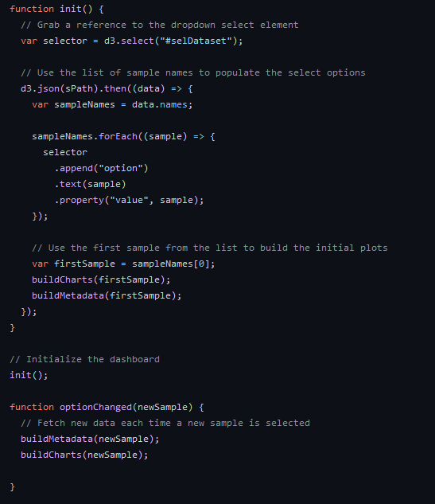
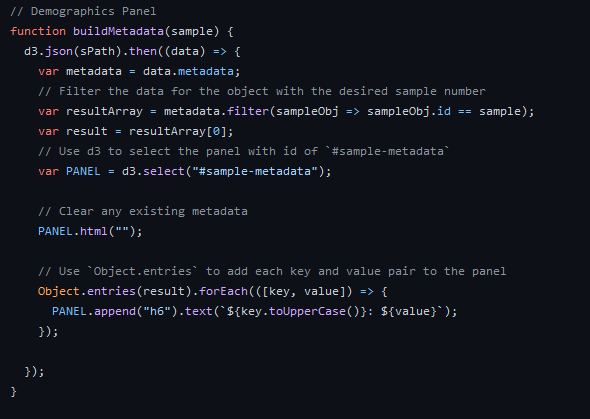
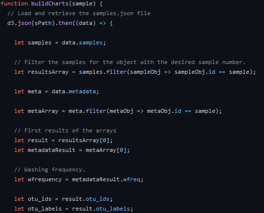
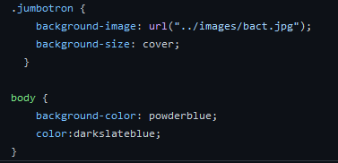

# Belly Button Biology

[link to website](https://sktwelve.github.io/Plotly/ "website")

## Overview:

This website is first populated by the first entry of the json file which is then pushed to the javascript file connected to the site. The javascript is used to create the charts using the json file entries. The code itself is called using D3, changing the charts when the option on the dropdown menu is changed. CSS is used to then customize the page to make the theme of the page blend together and be visually appealing.

## Results:

### Dashboard

First the dashboard is built using the data for the default subject using the data held on a separate file. The initial plots are built with the dropdown for the selection of a diffent subject's id.

### Selector

The dropdown menus contains all the ids for each entry in the data file. Once the new id is clicked, the initialization process is run again with the loaded data.

### Charts

### Style

Simple use of a jumbotron for a background image and a change to the background color to match it.

